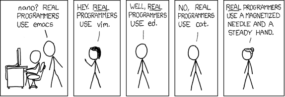

# The Zen of Refactoring


Refactoring is the process of restructuring existing computer code -- changing its *factors* -- without changing its behavior. You probably knew that. But did you know it’s also a meditation technique? Come improve your practice of mindful coding.

After these slides, we’ll start with some actual production code, make sure its unit tests work ok, then collaboratively, consciously contemplate the many forking paths that twine and wind through the Garden of Abstract Delights.

# What is refactoring?

* refactoring is a process

> refactoring (verb): to restructure software by applying a series of refactorings without changing its observable behavior

* *a* refactoring is a technique

> refactoring (noun): a change made to the internal structure of software to make it easier to understand and cheaper to modify without changing its observable behavior

(definitions by [Martin Fowler](http://martinfowler.com/))

# What is Zen?

> mostly an excuse for pretty pictures and hippie jokes


> disclaimer: This presentation uses some
> spiritual imagery but is not intended to
> parody any religion or culture
> (except American New Age Hippies)

# What is Refactoring?

Refactoring is changing code without changing its behavior.

# What is Refactoring?

Refactoring is changing code without changing its behavior.

Refactoring is change without change.

# What is Refactoring?

Refactoring is changing code without changing its behavior.

Refactoring is change without change.

Refactoring is Zen.

# refactoring is NOT

rewriting

rebuilding

porting

upgradging

debugging

# Why refactor?


(Yoda ≈ Buddha)

# Refactor to understand

clarity calm insight knowledge understanding


See the code for what it is, not what you think it is, or what you want it to be

# Refactor to remove duplication

DRY


# Refactor to increase code clarity

sometimes clarity requires *more* duplication

# What is code clarity?

Clear code is:

* readable
* modular
* maintainable
* ready for teamwork
* ready for change

# rereading and rewriting

> “Curiously enough, one cannot read a book; one can only reread it. A good reader, a major reader, an active and creative reader is a rereader.” - Nabokov

- applies to refactoring code too, not just rereading books
- your second solution will usually be better than your first
- code is a communication medium

https://www.goodreads.com/quotes/34497-curiously-enough-one-cannot-read-a-book-one-can-only

# "Zen Refactoring"

Let your eyes blur and scroll through the code

See what pops out

  * duplication?
  * repetition?
  * long lines? long methods?
  * strange gaps?
  * comments?

# How?

1. Write some tests
2. Change the code
3. Run the tests
4. Move ahead, or move back (revert)

# Tests Are Essential

run them before

change them during

tests are an extension of code

# What are the qualities of a refactoring?

# Reversible


# Mechanical


# Brief

or at least made of many short, reversible steps

# Automated

I choose my text editor based on how well it refactors my code


<https://xkcd.com/378/>

# Refactoring: Rename

The simplest and most powerful

* in VS Code: <kbd>F2</kbd>

# Refactoring: Extract

Extract Variable, Extract Function, Extract Method

# Example: Extract Function

```
@@@javascript
console.log('' + new Date() + ' - error: too many notes') 
console.log('' + new Date() + ' - error: not enough cowbell')
```

=>

```
@@@javascript
function logError(message) {
    console.log('' + new Date() + ' - error: ' + message)
}
logError('too many notes')
logError('not enough cowbell')
```

# Refactoring: Inline

"Inline" is the reverse of "Extract"

Introduces duplication to increase clarity

# Refactoring: Replace Comment With Name

A medium-length comment can often be replaced with a variable / function / method / class whose name is the comment

> "A comment is a lie waiting to happen." - Alex

# Example: Replace Comment With Name

```
@@@javascript
// 11 days at 24 hours per day times 60 minutes per hour
let duration = 11 * 24 * 60 
```

=>

```
@@@javascript
let hoursPerDay = 24
let minutesPerHour = 60
let durationInMinutes = 11 * hoursPerDay * minutesPerHour
```

# Refactoring: Introduce Parameter

* to take literals and make them variables, so the function is more useful
* to remove global variables -- pass them in as parameters instead
* good followup to "extract method"
* good when used with default parameters (ES2015)

```
@@@javascript
function logError(message, severity = 'error') {
    console.log('' + new Date() + ' - ' + severity + ': ' + message)
}
logError('too many notes')
logError('volume too low', 'warning')
```

# Refactoring: Extract Object (Struct)

* objects are great for keeping related data together
* also good for keeping your code readable, since fields are named by the caller, not just the receiver

# Example: Extract Object (Struct)

```
@@@javascript
function distanceBetween(x1, y1, x2, y2) {
    let deltaX = x2 - x1;
    let deltaY = y2 - y1;
    return Math.sqrt(deltaX * deltaX + deltaY * deltaY)
}
let distance = distanceBetween(41.12, -72.22, 42.18, -72.34)
```

=>

```
@@@javascript
function distanceBetween(point1, point2) {
    let deltaX = point2.x - point1.x;
    let deltaY = point2.y - point1.y;
    return Math.sqrt(deltaX * deltaX + deltaY * deltaY)
}

let distance = distanceBetween( { x: 41.12, y: -72.22 },
                                { x: 42.18, y: -72.34 })
```

> This type of object -- with fields but no methods -- is sometimes called a `struct`.

# Refactoring: Extract Class

* a class is for sharing methods between all related object instances

```
@@@javascript
class Point {
    distanceFrom(otherPoint) {
        let deltaLat = otherPoint.x - this.x;
        let deltaLon = otherPoint.y - this.y;
        return Math.sqrt(deltaLat * deltaLat + deltaLon * deltaLon)
    }
}

let point1 = new Point();
point1.x = 41.12
point1.y = -72.22
let point2 = new Point();
point2.x = 42.18
point2.y = -72.34

let distance = point1.distanceFrom(point2)
```

# Refactoring: Introduce Constructor

* a constructor is used to initialize your object
* helps ensure that all the instance data is in a valid state
* streamlines your initialization code

```
@@@javascript
class Point {
    constructor(x, y) {
        this.x = x;
        this.y = y;
    }
    //... 
}
let point1 = new Point(41.12, -72.22)
let point2 = new Point(42.18, -72.34)
let distance = point1.distanceFrom(point2)

```

# Code Smells

a "code smell" means "something might be wrong here"

* Long Method
* Long Line
* Nested `if`s
* Duplicated code
  * can be cured by Extract Method and Introduce Parameter
* *[Feature Envy](https://sourcemaking.com/refactoring/smells/feature-envy)*
  * when a method accesses the data of another object more than its own
  * can be cured by **Refactoring: Move Method**

more at [Code Smells](https://sourcemaking.com/refactoring/smells)

# Some Guidelines

* Short Lines
* Short Methods
* Meaningful Names
* Fewer Dots-in-a-row
  * (but don't confuse *method chaining* (often good) with *feature envy* (usually bad))

# The Book


<https://martinfowler.com/books/refactoring.html>

...coming soon in JavaScript!

# References

* http://refactoring.com/
* http://refactoring.com/catalog/
* http://martinfowler.com/books/refactoringRubyEd.html
* https://sourcemaking.com/refactoring
