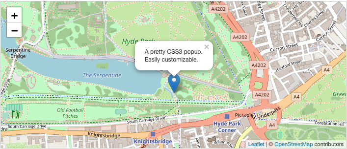

# Introduction to LeafletJS

* LeafletJS is a JavaScript **library** which allows for the creation of and interaction web maps.
* It uses a simple API for building maps using **Layers**
* It allows for styling of the map layers using standard CSS, and manipulation using JavaScript

# Simple Map Example

* Let's make a simple map



```js
@@@js
var map = L.map('map').setView([51.505, -0.09], 13);

L.tileLayer('https://{s}.tile.openstreetmap.org/{z}/{x}/{y}.png', {
    attribution: '&copy; <a href="https://www.openstreetmap.org/copyright">OpenStreetMap</a> contributors'
}).addTo(map);

L.marker([51.5, -0.09]).addTo(map)
    .bindPopup('A pretty CSS3 popup.<br> Easily customizable.')
    .openPopup();
```

# Installation

Include the CSS and JavaScript in the Head of the HTML page

**Add the CSS First**

```html
@@@html
 <link rel="stylesheet" href="https://unpkg.com/leaflet@1.3.1/dist/leaflet.css"/>
```

**Then the JavaScript**

```html
@@@html
<!-- Make sure you put this AFTER Leaflet's CSS -->
 <script src="https://unpkg.com/leaflet@1.3.1/dist/leaflet.js"></script>
```

**Then create the map container**

```html
@@@html

<div id="mapid"></div>
```

**Then use CSS to create a height for the container**

```css
@@@css

#mapid { height: 180px; }
```

# Using a Basemap

* Basemaps are the **Tiles** that show the roads, features, and labels for the map
* You add the basemap to the **map container**

### Mapbox Basemap Example

```js
@@@js
L.tileLayer('https://api.tiles.mapbox.com/v4/{id}/{z}/{x}/{y}.png?access_token={accessToken}', {
    attribution: 'Map data &copy; <a href="https://www.openstreetmap.org/">OpenStreetMap</a> contributors, <a href="https://creativecommons.org/licenses/by-sa/2.0/">CC-BY-SA</a>, Imagery © <a href="https://www.mapbox.com/">Mapbox</a>',
    maxZoom: 18,
    id: 'mapbox.streets',
    accessToken: 'your.mapbox.access.token'
}).addTo(mymap);
```

# Adding Markers

# Removing Markers

# Adding Polygons

# Point-within-polygon
