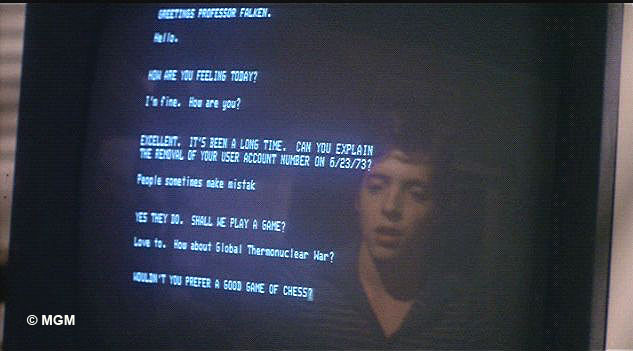

# What is a computer?

* A calculating machine
  * desktop
  * laptop
  * cell phone
  * smart phone
  * thermostat
  * credit card
  * hotel room door

# The Terminal

* the *TERMINAL* is a window into which you can talk directly to your computer

from WarGames, (1983)

# In The Beginning Was The Command Line

* the *TERMINAL* is a window into which you can talk directly to your computer
* aka *console* or *command line* or *command prompt* or *shell* or *prompt*
  * contrast *CLI* (Command Line Interface) to *GUI* (Graphical User Interface)

* ["In The Beginning Was The Command Line"](http://www.cryptonomicon.com/beginning.html) is an essay by Neil Stephenson describing the history of computers in an enjoyable and clever way

# node - the Interactive JavaScript Executor

## Exercise: Calculator

* open a terminal
* type `node`
* press the <kbd>Return</kbd> key (also called <kbd>Enter</kbd>)
* see the `>` prompt
* type `1 + 1`
* press the `return` key again
* see the `2`
* Yay! Your computer is an expensive calculator!

* Bonus: what other math can you do?

* From now on, whenever you see text in the `code font`, try typing it into node and see what happens!

# Computer Anatomy

* hardware
  * CPU
  * Memory
  * Storage
  * Input/Output Devices (monitor, keyboard, etc.)
* software
  * Operating System
  * Drivers
  * Programs
* wetware
  * that's you!

# Computer Anatomy: Hardware

* CPU ("the brain")
* Memory
* Input/Output
  * keyboard, mouse, touch screen, monitor

The basic architecture of computers has not changed since the invention of the
[Von Neumann Architecture](https://en.wikipedia.org/wiki/Von_Neumann_architecture)
in the 1940s.

# Computer Anatomy: Software

* Operating System
* Libraries
* Drivers
* Applications
* Languages

Every piece of software on your computer is a PROGRAM.

# A Program Is Like A Recipe

* a recipe is a collection of *ingredients* and *instructions*

* a program is a collection of *data* and *code*

> When you are writing code, you are not baking cookies, you are writing a recipe for how to make cookies.

(recipe from http://www.popcornpottery.com/rec.html)

# Languages

* every program is written in a LANGUAGE
  * like Java or Python or C or Fortran
  * even HTML and CSS and SQL are languages
  * every computer language has a silly name
* different languages are useful in different areas, but there is a lot of overlap
* today we will learn the JavaScript programming language

# Errors Are Awesome

* Don't be afraid of errors
* Your computer is trying to help you fix your program
  * It's just *really* bad at communicating

> If your code is a two-year-old child, then an error is a temper tantrum.

(It can take effort to figure out why they're upset and fix it.)

* It's not all gibberish
* Try to read it -- really try! -- and pull out the pearls from the pig slop

See also: [What went wrong?](https://developer.mozilla.org/en-US/docs/Learn/JavaScript/First_steps/What_went_wrong) from MDN
