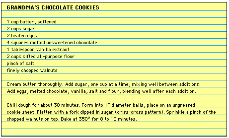

    topic name: "text-editor"
    link name: 'How to Design Programs (preface)',
         href: "https://htdp.org/2018-01-06/Book/part_preface.html"
    link name: "Khan Academy: How Computers Work",
            href: "https://www.khanacademy.org/computing/computer-science/how-computers-work2/v/khan-academy-and-codeorg-what-makes-a-computer-a-computer"

# Part 1: Intro

You may never have coded before. Today you will.

# What will we learn?

In this class, you will learn about:

*  Code and coding
*  The command line and why we use it
*  How to run your code interactively or from a file
*  How to make a very simple website run on your own computer
*  How to deploy your website to the cloud, where anyone in the world can visit

Follow along online! Put a browser pointed at this site on one side of your screen, and Terminal on the other.

# What if I know some of this already?

* Pair up
* Help your partner, help your neighbor
* Docendo discimus ("By Teaching We Learn")
* Promote yourself to TA

> The best way to learn is to teach.  - [Latin proverb](https://en.wikipedia.org/wiki/Docendo_discimus)

# What is code?

Generally, *code* is something that stands for something else.

Specifically, *source code* is a series of instructions that tell a computer what to do.

> With computers, "code" is not about **secrets** -- it's about **symbols**.

# What is coding?

* coding (aka programming or software development) is a *creative, human* activity
* *coding* does not mean "cracking the code" or "deciphering" -- it's not a mystery or a secret, it's a language
* the words (and numerals and punctuation) we write are then translated (*encoded*) into long strings of ones and zeros

# What is coding NOT?

* coding is **not** mathematical
  * some logic (if / then / and / or / etc.)
  * mostly just counting ("do this 10 times")
* coding is **not** solitary
  * most coding happens in a team
  * all professional coding happens with clients / users / designers / managers etc.
  * pair programming is awesome
* coding is **not** about finding the right answer
  * there's always more than one way to do it
  * every solution has tradeoffs
  * there is always a better way, and never a perfect way
  * often the hardest part of coding is *defining* the problem, not solving it

> "The only perfect program is an empty file." - Alex

# What is coding?

* coding is fun!
* coding is frustrating!
* coding is creative!
* coding is communication
  * between you and a computer
  * between you and other coders
  * between you and future you

# A Program Is Like A Recipe

* a recipe is a collection of *ingredients* and *instructions*

* a program is a collection of *data* and *code*

> When you are coding, you are not baking cookies; you are writing a recipe for how to make cookies.

(recipe from popcornpottery.com)

# Languages

* every program is written in a **language**
  * like Java or Python or C or Fortran
  * even HTML and CSS and SQL are languages
  * computer languages all have very silly names
* computer languages are very **specific** compared to natural languages
* different languages are useful in different areas, but there is a lot of overlap
* today we will learn the JavaScript programming language

# Errors Are Awesome

* Don't be afraid of errors
* Your computer is trying to help you fix your program
  * It's just *really* bad at communicating

> If your code is a two-year-old child, then an error is a temper tantrum.

(It can take effort to figure out the underlying reason why they're upset and fix it.)

* It's not all gibberish
* Try to read it -- really try! -- and pull out the pearls from the pig slop

See also: [What went wrong?](https://developer.mozilla.org/en-US/docs/Learn/JavaScript/First_steps/What_went_wrong) from MDN

# Technical requirements

See the [Installfest](/projects/installfest) project for more instructions.

Software:

* a text editor - VS Code from Microsoft <https://code.visualstudio.com>
* JavaScript - a live node.js installation
* Git - version 2.x
* GitHub 
  * **Sign up** for an account at <https://github.com/>
  * Add an SSH key to your GitHub account; follow these instructions: <https://help.github.com/articles/connecting-to-github-with-ssh/>
* Heroku
  * **Sign up** for an account at <https://signup.heroku.com>
  * **Install** the Heroku Command Line Interface (CLI) at <https://devcenter.heroku.com/articles/heroku-cli>

* Please stop right now and check
  * If you do not have these, RAISE YOUR HAND

# Part 2: Meet Your Computer

# Parts of a Computer

* Input (keyboard, mouse, network)
* Storage (disk drive aka *filesystem*)
* Memory (RAM)
* Processor (CPU)
* Output (screen, sound, network)

# Parts of a Command-Line Program

* source file
* command line
* "node" engine (it "runs" your code)
  * [train pulling a file]

# Parts of a Web Applicaton

# The Command Line

# Moving around the file system

# Node, The JavaScript Console

# Using Git to Deploy to the Cloud

# Lab: Hello, Express

Now it's time to write and deploy an app!

Click here for instructions: [Hello, Express](/lessons/server_side_javascript/hello_express)

This lab will teach you these concepts:

 * writing and saving source code in a file
 * launching an application server on your own computer
 * deploying code to the cloud
 * passing parameters from a client to a server

# What else is there to learn?

 * Values, Variables, Functions, Objects, etc.
 * Web Style and Layout with HTML and CSS
 * Web Interactivity with JavaScript
   * how do you make a web site interactive?
   * how do the parts of a site all fit together?
 * Databases
 * Desgining data models and algorithms 
 * Testing
    * manual QA
    * automated testing and test-driven development
    * Cypress (demo!)
 * How does software get built by teams?
   * the Agile Creative Process
   * keeping people happy and productive
   * iterative and incremental development

> What are you interested in? Any questions?

