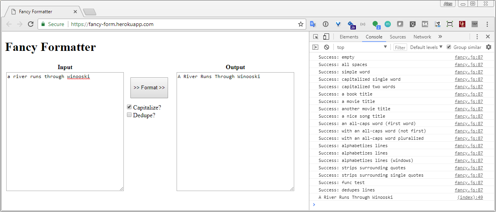
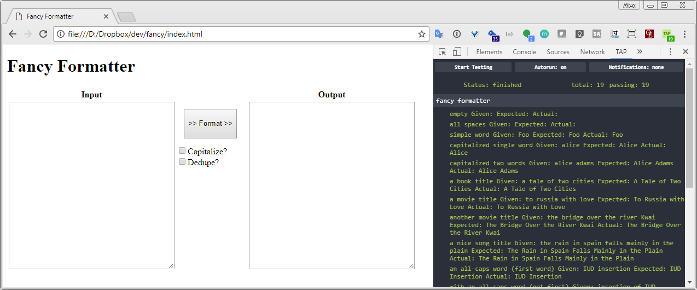

# No-Frills In-Browser Unit Testing

## or, Testing Framework? What Testing Framework?

> by Alex Chaffee <br>
> Burlington Code Academy

# The Best Tests

> "The best tests are the ones you actually write." - me

* Friction is the enemy of flow
* If you're in the zone, don't get distracted by setup...
* ...code first, fiddle with your framework later

# The Best Test Framework

```js
function assert(value) {
  if (!value) {
    console.log("Failure");
  }
}
```

All you need is <del>love</del>[assert](https://en.wikipedia.org/wiki/Assertion_(software_development).

# Even better

```js
function assert(value, why) {
  if (value) {
    console.log("Success: " + why);
  } else {
    console.error(new Error("Failure: " + why).stack);
  }
}
```

# console keeps calm and carries on

```javascript
console.assert(pageNumber >= 0 && pageNumber < numPages,
               'page number should be in range');
```

* This [built-in console.assert](https://developer.mozilla.org/en-US/docs/Web/API/console/assert) function works fine, but failures do not stop execution
* a custom `assert` function lets you "fail fast" which is usually a better idea for unit tests since a failure is more obvious and immediate

# Test As You Go - Step 1

> Start with the null case.

```js
function fancyText(s) {
    return '';
}

assert(fancyText('') === '');
```

"Run Test Suite" command: `F5` (Refresh)

# Test As You Go - Step 2

> Write code one test case at a time.

```js
function fancyText(s) {
    return s[0].toUpperCase() + 
      s.slice(1,s.length).toLowerCase();
}

assert(fancyText('') === '');
assert(fancyText('apple') === 'Apple');
```

...and so on (see https://fancy-form.herokuapp.com/ )

# Self-Testing Web Sites



# TAP


* TAP is a test output format
  * *Test Anywhere Protocol*
* `tape` is a JS implementation of TAP that works in browsers
  * with a little help from `browserify` :-)
* `tap` is a node module that runs on the command line

<small>image from http://hopefuls-rph.tumblr.com/post/88053060131/important-things-to-keep-in-mind-when-portraying-a</small>


# Tapped Out



# Tapped Source: fancy.js

`t.equal` is tap's `assert` :

```js
var test = require('tape');
if (window.tapExtension) {
  test = window.tapExtension(test);
}

function fancyText(s) {
  return s[0].toUpperCase() + 
    s.slice(1,s.length).toLowerCase();
}

test('fancy formatter', function(t) {
  t.equal(fancyText(""), "", 
    "should not do anything to an empty string");
  t.equal(fancyText("bob"), "Bob", 
    "should capitalize a single word");
  t.end()
});
```

# Tapped Source: fancy-bundle.js

shell:

```sh
npm install --save-dev browserify tape
browserify -o fancy-bundle.js --standalone fancyText fancy.js
```

* [browserify](http://browserify.org) rewrites & smooshes server-side JS files and libraries into a single file
* `-o fancy-bundle.js` means "output all the JS into this one file"
* `--standalone fancyText` means "make the `fancyText` function available to other scripts on the page"

# Tapped Source: index.html

```html
<button id="format" onclick="doFormat()">
>> Format >>
</button>
...
<script src="fancy-bundle.js"></script>
<script>
function doFormat() {
  var inputWidget = document.getElementById("input");
  var outputWidget = document.getElementById("output");
  var output = fancyText(inputWidget.value);
  outputWidget.value = output;
}
</script>
```

# Conclusion

* Testing is delicious, do it all the time
* Don't get trapped by your tools
* Do what works and fix it later (or don't)
* **Optional**: use a standard format like TAP
  * gives you an upgrade path from in-browser to command-line / continuous-integration / full suite
  * integrates with other tools (like [Browser-Tap](https://chrome.google.com/webstore/detail/browser-tap/ncfblaiipckncgeipgmpdioedcdmofei) and [tap-spec](https://www.npmjs.com/package/tap-spec))
  * might be more familiar to teammates 

## Links

* https://fancy-form.herokuapp.com/
* http://codelikethis.com/lessons/javascript/no_frills_testing
* [Browser-Tap](https://chrome.google.com/webstore/detail/browser-tap/ncfblaiipckncgeipgmpdioedcdmofei) Chrome Extension
* the [built-in console.assert](https://developer.mozilla.org/en-US/docs/Web/API/console/assert) function works fine, but failures do not stop execution; a custom `assert` function lets you "fail fast"
