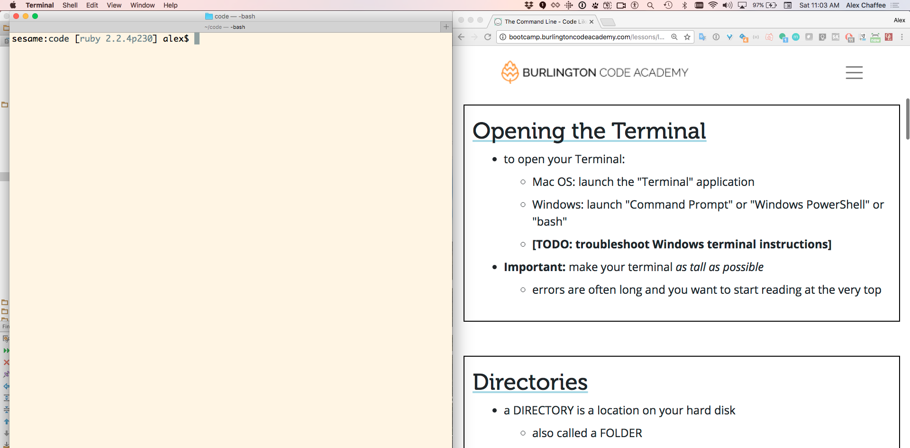
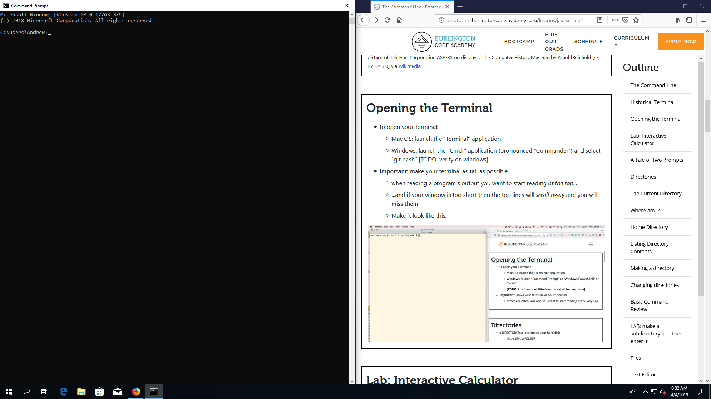

# Technical requirements

See the [Installfest](/projects/installfest) project for more instructions.

Software:

* a text editor (VS Code from Microsoft)
* a JavaScript engine (NodeJS)
* Git

Accounts:

* GitHub
  * **Sign up** for an account at <https://github.com/>
  * Add an SSH key to your GitHub account; follow these instructions: <https://help.github.com/articles/connecting-to-github-with-ssh/>
* Heroku
  * **Sign up** for an account at <https://signup.heroku.com>
  * **Install** the Heroku Command Line Interface (CLI) at <https://devcenter.heroku.com/articles/heroku-cli>

> If you do not have these, RAISE YOUR HAND!

# A Taste of JavaScript

You may never have coded before. Today you will.

# What will we learn?

In this class, you will learn about:

*  Code and coding
*  The command line and why we use it
*  How to run your code interactively or from a file
*  How to make a very simple website run on your own computer
*  How to deploy your website to the cloud, where anyone in the world can visit

Follow along online! Put a browser pointed at this site on one side of your screen, and Terminal on the other.

# What if I know some of this already?

* Pair up
* Help your partner, help your neighbor
* Docendo discimus ("By Teaching We Learn")
* Promote yourself to TA

> The best way to learn is to teach. <br>- [Latin proverb](https://en.wikipedia.org/wiki/Docendo_discimus)

# What is code?

Generally, *code* is something that stands for something else.

Specifically, *source code* is a series of instructions that tell a computer what to do.

> With computers, "code" is not about **secrets** -- it's about **symbols**.

# What is coding?

* coding is fun!
* coding is frustrating!
* coding is creative!
* coding is communication
  * between you and a computer
  * between you and other coders
  * between you and future you

# What is coding NOT?

* coding is **not** advanced mathematics
  * some logic (if / then / and / or / etc.)
  * mostly just counting ("do this 10 times")
* coding is **not** solitary
  * most coding happens in a team
  * all professional coding happens with clients / users / designers / managers etc.
  * pair programming is awesome
* coding is **not** about finding the right answer
  * there's always more than one way to do it
  * every solution has tradeoffs
  * there is always a better way, and never a perfect way
  * often the hardest part of coding is *defining* the problem, not solving it

> "The only perfect program is an empty file." - Alex

# A Program Is Like A Recipe

* a recipe is a collection of *ingredients* and *instructions*


* a program is a collection of *data* (ingredients) and *code* (instructions)

> When you are coding, you are not baking cookies; you are writing a recipe for how to make cookies.

Writing a recipe involves trying out the recipe (baking a test batch), then tweaking the recipe and trying again and again until you get it right.

<small>(recipe from popcornpottery.com)</small>

# Languages

* every program is written in a **language**
  * like Java or Python or C or Fortran
  * even HTML and CSS and SQL are languages
  * computer languages all have very silly names
* computer languages are **very specific** compared to natural languages
* different languages are useful in different areas, but there is a lot of overlap
* today we will play with the JavaScript programming language

# Errors Are Awesome

* Don't be afraid of errors
* Your computer is trying to help you fix your program
  * It's just *really* bad at communicating

> If your code is a two-year-old child, then an error is a temper tantrum.

(It can take effort to figure out the underlying reason why they're upset and fix it.)

* It's not all gibberish
* Try to read it -- really try! -- and pull out the pearls from the pig slop

See also: [What went wrong?](https://developer.mozilla.org/en-US/docs/Learn/JavaScript/First_steps/What_went_wrong) from MDN

# Lab: Opening the Terminal

* to open your Terminal:
  * **Mac OS**: launch the "Terminal" application
  * **Windows**: launch the "Cmder" application (pronounced "Commander"), make a new console (<kbd>Ctrl</kbd>-<kbd>T</kbd>) and select
    * Startup command: `{bash::bash}`
    * Startup directory: `C:\Users\yourname`
  * *Windows (alternate)*: Launch the Windows Command Prompt (`cmd.exe` or `PowerShell`) -- but beware, the commands are slightly different than in bash

* **Important:** make your terminal as **tall** as possible and *don't overlap windows*
  * when reading a program's output you want to start reading *at the top*...
  * ...and if your window is too short then the top lines will *scroll away* and you will miss them
  * Make it look like this:




# Lab: Interactive Calculator

1. open a terminal
1. look at the prompt -- it should end with a `$` or `>` symbol
1. type `node` -- that's you *commanding* the computer to launch *node*
1. press the <kbd>Return</kbd> key (also called <kbd>Enter</kbd>)
1. see the `>` prompt
1. type `1 + 1`
1. press the <kbd>Return</kbd> key again
1. see the `2`

* Yay! Your computer is an expensive calculator!
* **Bonus**: what other math can you do?

# Node is a JavaScript Engine


An "engine" is a type of program that either [*executes* or *empowers*](https://en.wikipedia.org/wiki/Software_engine) other programs.

NodeJS (aka `node`) is an engine that runs JavaScript programs -- either from files, or interactively from the command line.

# A Tale of Two Prompts

> WARNING: Before you start typing, look at the prompt!

* *the shell* is the command line interpreter that the terminal starts with
  * its prompt is usually
    *  `Davids-Macbook-Pro:~ David$` (Mac)
    *  `david@davidspc:~$` (Ubuntu Linux)
    *   `C:\Users\david>` (Windows)
* *node* is a command line program that is launched *from the shell*
  * its prompt is usually `>`

From inside `node`, if you want to get back to the shell...

  * type <kbd>Ctrl</kbd>-<kbd>C</kbd> twice
  * or type `.exit` and <kbd>Enter</kbd>

# When in doubt, try it out!

From now on, whenever you see text in the `code font`, try typing it into the terminal and see what happens! For example:

```javascript
'pod' + 'cast'
```

If that doesn't print `'podcast'`, look at the prompt; you may be inside your shell instead of inside node.

# Directories

* a *directory* is a location on your hard disk
  * also called a *folder*
* directories can contain *files*
* directories can also contain other directories (called *subdirectories*)

# Where am I?

* Inside the Terminal, you are always "inside" a directory.
* It is very easy to get lost in a maze of directories.
* To find out which directory you are in, type: <kbd>p</kbd><kbd>w</kbd><kbd>d</kbd><kbd>Return</kbd>
  * This stands for "print working directory" (not "password").
  * Most of the time you can also look at the prompt to see what the current directory is.

# Home Directory

* when you first open the Terminal you are in your HOME DIRECTORY
* if you store files directly in your home directory, it will soon get cluttered
* for this class, we recommend:
  * create a `code` directory inside your home directory
  * create a new directory inside `code` for each lesson or project
> WARNING: On some windows systems, Command Prompt will open to `C:\Windows\System32`

> WARNING: On some windows systems, Command Prompt will open to `C:\Windows\System32`. You can get back to your home directory by typing `cd %HOME%`

# Listing Directory Contents

* when you type `ls` ("list") it shows the contents of the current directory
  * **On Windows** you may need to type `dir` instead

* if you type `ls -al` ("list all long") it also shows *hidden* files and *extra info* like the modification date
  * **On Windows** you may need to type `dir /A:SH` instead

# Making a directory

* when you type `mkdir` ("make directory") it creates a new *subdirectory* inside the current directory

```bash
mkdir code
```

# Changing directories

* `cd` ("change dir") moves you into a different directory
* For example, `cd code` would move you into a subdirectory named `code`
* If you ever get lost, type `cd` all on its own and press the return key. This will send you back to your home directory.
  * (unix shell only, not Windows)

# Basic Command Review (Unix)

* `pwd` ("print working dir") -- shows the name of the current directory
* `ls` ("list") -- shows the contents of the current directory
* `mkdir` ("make dir") -- creates a new subdirectory inside the current directory
* `cd` ("change dir") -- move into a different directory

> These apply to Mac / Unix / Linux / bash

# Basic Command Review (DOS)

* `cd` ("change dir") -- With no directory, it lists the current directory. Otherwise, it changes to the specified directory
* `dir` ("directory") -- shows the contents of the current directory
* `mkdir` ("make dir") -- creates a new subdirectory inside the current directory

> These apply to Windows / DOS / PowerShell

# LAB: make a subdirectory and then enter it

1. open **Terminal** or **Command Prompt**
1. Confirm that you are in your home directory
2. make a new subdirectory using `mkdir code`
3. change into that directory using `cd code`
4. make sure you're really there using `pwd`
   * **On Windows** use `cd`
5. list its contents using `ls` (and note that it's empty)
   * **On Windows** use `dir`

# Files

* a file is a place on disk for storing stuff
* "stuff" here could be anything at all
  * documents, pictures, sounds, applications...
* every file lives inside a directory

# Text Editor

* a text editor is a program that edits a text file
* a text editor is *like* a word processor
* but a text editor is **not** a word processor
* You probably have *VS Code* <https://code.visualstudio.com/>
  * others include *TextMate*, *Notepad++*, *Sublime Text*, *Vim*, *Emacs*, *Atom*
  * but **NOT** *TextEdit* or *Wordpad* or *Microsoft Word*

# Source File

* source code is the essence of a program
* source files are text files that contain source code
* to **RUN** a JavaScript program you type `node` and then the name of the source file, like this:

```bash
$ node hello.js
Hello, World!
```

* The Recipe Metaphor
  * source file ≈ recipe
  * running a program ≈ cooking

# LAB: Hello, World

1. Make sure you are in your `code` subdirectory using `pwd` or `cd`
2. Open this directory in your text editor
    * for VSCode, use `code .` ("code dot")
3. Create a file named `hello.js` using the *File > New* menu
4. Inside this file, put the following source code:

        console.log("Hello, World!");

5. Save the file
6. Switch back to the terminal (using <kbd>Alt</kbd>-<kbd>Tab</kbd> or <kbd>Cmd</kbd>-<kbd>Tab</kbd> or clicking)
  <br>(If you are using VS Code, you can click **Terminal &rarr; New Terminal** for the built-in terminal panel)
7. Run this file using `node hello.js`

What happens? Is this what you expected?

# Command-Line Shortcuts

These work in `bash`:


Also:

* you can use <kbd>Esc</kbd> instead of <kbd>Alt</kbd> for the above
* <kbd>Esc</kbd>-<kbd>Backspace</kbd> (delete previous word)
* up/down arrow (scroll through history)
* <kbd>End</kbd> and <kbd>Home</kbd> (jump to end or beginning of line)
* <kbd>Tab</kbd> for auto-completion of filenames (e.g. typing `node h`<kbd>Tab</kbd> will emit `node hello.js`)

<small>(image source: [Clément Chastagnol](https://clementc.github.io/blog/2018/01/25/moving_cli/))</small>
