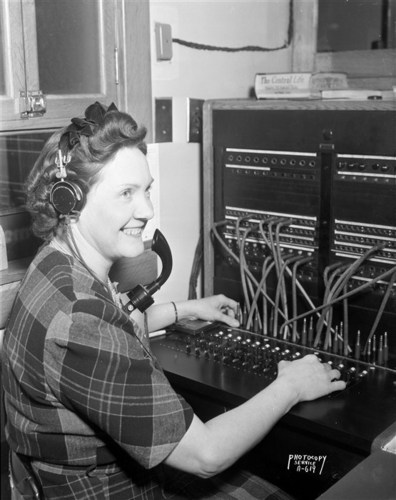

# Objects

An OBJECT is a location in computer memory where you can store DATA.

[todo: say "values" or "info" instead of "data"?]

There are many kinds of objects, including String, Number, Array, Hash, Time... These are called CLASSES. 

Some day soon you will create your own classes but for now, we will use the built-in ones.

# Numbers

A NUMBER is what it sounds like.

    10
    -12
    3.14

# Strings

A STRING is a collection of characters, like a word or a sentence.

    "apple"
    "banana"
    "Cherry Pie"

# Messages and Operators

An object responds to MESSAGES. You send it messages using OPERATORS.

The most powerful operator is DOT. 

On screen she looks like a period, but here's what she looks like up close:

Dot can send any message she likes, by name, to any object.

    "apple".upcase
    
# Other Operators

There are other operators, like PLUS (`+`) and TIMES (`*`), but they only send one message each.

And remember, Dot is more powerful than any other operator!

    2 + 7

is the same as

    2.+ 7

Both send the message `+` to the object `2`.

# Return Values

Every time an object receives a message, it returns a response.

The response is also called the VALUE or the RETURN VALUE.

You can think of it as the answer to a question. 

    2 + 2    # Question: What is 2 + 2?
    4        # Answer: 4

    "apple".upcase  # Q: What is the upcase of the string "apple"?
    "APPLE"         # A: the string "APPLE"

# String Messages

A string understands lots of messages. Here are a few:

    "banana".upcase
    "Cherry".downcase
    "date".capitalize
    "elderberry".reverse
    "fig".length
    "Fig Newton".swapcase

Try all of these out in irb!

# String Operators

A string also understands several other operators:

    "blue" + "berry"
    "yum" * 10
    "elderberry"[8]

`+` `*` and `[]` are pronounced PLUS, TIMES, and SUB

Try these out in irb!

# Combining Messages and Operators

You can combine messages and operators at will.

    "fig".upcase.reverse
    "grape".reverse * 10 + "!!!"

Definitely try these out in irb! It's pretty fun.

# LAB: Playing With Strings And Numbers

Answer the following questions using irb:

* How many seconds are in an hour?
* How many seconds are in a week?
* What is the reverse of "stressed"?
* What does your name look like, repeated 1000 times?
* What is the tenth character of "Matz is nice"? (Trick question!)

# Strings are not numbers

Hmmm....

    1 + 2
    "1" + "2"
    "1 + 2"

# Strings vs. Numbers

Hmmm again...

    "1" + 2

Uh-oh!

    TypeError: can't convert Fixnum into String

Don't panic! The solution is easy.

# Conversion

Numbers know a message that converts them into strings. `to_s` means "to string".

    "1" + 2.to_s
    
Likewise, strings know a message that converts them into numbers.
    
    1 + "2".to_i

`to_i` means "to integer".

# Advanced (skippable)

* to_f
