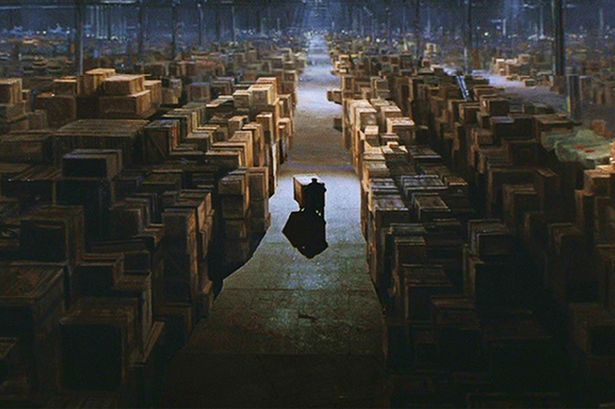

# Variables

A VARIABLE is a NAME for an object. You give an object a name using the ASSIGNMENT operator (it looks like an equal sign).

    color = "blue"
    fruit = "berry"

Anywhere you can use an object, you can use a variable instead.

    color + fruit
    fruit.upcase
    
# The Warehouse Metaphor

If memory is a giant warehouse...

...and objects are boxes in that warehouse

...then data is the **contents** of a box

...and a variable is a **label** you stick on the outside of the box

# Changing Variables

You can assign and reassign variables at will.

    color = "blue"
    fruit = "berry"
    color + fruit
    
    color = "black"
    color + fruit
    
Changing a variable (using ASSIGNMENT) just changes the name of an object. It does *not* change the data inside the object.

# Changing Values

Most messages do not change the data inside the object.

    color.upcase
    color

But some messages do change the data!
    
    color.upcase!
    color

This can be dangerous so sometimes those messages end with a BANG (exclamation point).

[ later: multiple variables pointing to same object, etc. -- needs memory model diagram / animation ]

# Lab: Play In IRB

Let's spend 15 minutes just playing around in IRB. Some things to try:

* write a poem
* YELL THE POEM
* calculate 2 + 2 and more complicated things
* assign your best friend to a variable
* reverse your best friend's name
* get a new best friend and reverse her too
