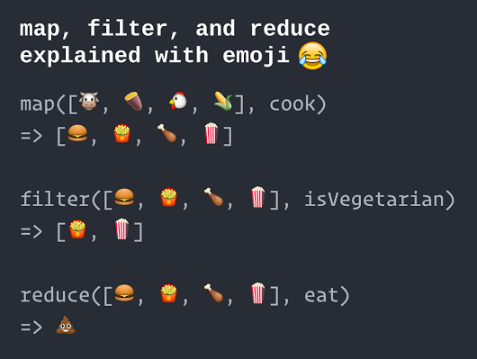

    topic name: "each"
    topic name: "map"
    topic name: "filter"
    topic name: "reduce"
    topic name: "callbacks"
    link name: "Higher-order Functions",
         href: "http://eloquentjavascript.net/05_higher_order.html",
         from: "EloquentJavaScript"

# Filter Functions

a JavaScript array has a few very handy methods
that let you *apply a function* to its contents.

| method | description | returns |
|---|---|---|
| [`forEach`](https://developer.mozilla.org/en-US/docs/Web/JavaScript/Reference/Global_Objects/Array/find)  | do something to each item | `undefined`|
| [`find`](https://developer.mozilla.org/en-US/docs/Web/JavaScript/Reference/Global_Objects/Array/find)  | find the first item that matches | one item |
| [`filter`](https://developer.mozilla.org/en-US/docs/Web/JavaScript/Reference/Global_Objects/Array/filter) | accept or reject each item | a new collection, possibly smaller |
| [`map`](https://developer.mozilla.org/en-US/docs/Web/JavaScript/Reference/Global_Objects/Array/map)  | change each item into a new item | a new collection of the same size |
| [`reduce`](https://developer.mozilla.org/en-US/docs/Web/JavaScript/Reference/Global_Objects/Array/reduce)  | scan the entire collection and "reduce" it | one thing |

We call this group of methods "filter functions" or "iterator methods".

# forEach

`forEach` works a lot like `for..of`

Given:

```javascript
let names = ['Alice', 'Bob', 'Charlie', 'Carol', 'David']
```

this:

```javascript
for (let name of names) {
    console.log(name.toUpperCase());
}
```

and this:

```javascript
let printUpper = function(word) {
  console.log(word.toUpperCase());
}
names.forEach(printUpper);
```

both print:
```
ALICE
BOB
CHARLIE
CAROL
DAVID
```

# Find

to find the first item that matches the condition...

```javascript
let names = ['Alice', 'Bob', 'Charlie', 'Carol', 'David']
let beginsWithC = function(word) {
    return word.charAt(0).toUpperCase() === 'C';
}
names.find(beginsWithC) //=> 'Charlie'
```

# Find Inline

For conciseness, people often define the filter function *inline*, like this:

```javascript
names.find((word) => word.charAt(0).toUpperCase() === 'C')
```

Q: Is this more or less clear than the previous slide?

# Filter

```javascript
let names = ['Alice', 'Bob', 'Charlie', 'Carol', 'David']
let beginsWithC = function(word) {
    return word.charAt(0).toUpperCase() === 'C';
}
names.filter(beginsWithC) //=> [ 'Charlie', 'Carol' ]
```

# Map

```javascript
let names = ['Alice', 'Bob', 'Charlie', 'Carol', 'David']
let upper = function(word) {
    return word.toUpperCase();
}
names.map(upper) //=> [ 'ALICE', 'BOB', 'CHARLIE', 'CAROL', 'DAVID' ]
```
# Lab: Titleize with Map

Remember capitalize? It only capitalizes the first letter of the whole string.

```javascript
function capitalize(word) {
  let firstLetter = word[0];
  let restOfWord = word.slice(1);
  return firstLetter.toUpperCase() + restOfWord.toLowerCase();
}
```
Now please try to write a function that capitalizes *each word* in a string.

```javascript
titleize("the rain in spain falls MAINLY on the PLAIN")
  //=> 'The Rain In Spain Falls Mainly On The Plain'
```

There is a solution on the next slide, but please try on your own first.

# Solution: Titleize

Here's one way to do it:

```javascript
function titleize(phrase) {
  return phrase.split(' ').map((word) => capitalize(word)).join(' ');
}
```

Here's another:

```javascript
function titleize(phrase) {
  return phrase.split(' ').map(capitalize).join(' ');
}
```

And another:
```javascript
function titleize(phrase) {
    let words = [];
    phrase.split(' ').forEach((word) => {words.push(capitalize(word))});
    return words.join(' ');
}
```

# Map Filter Reduce in Emoji



(source unknown)
