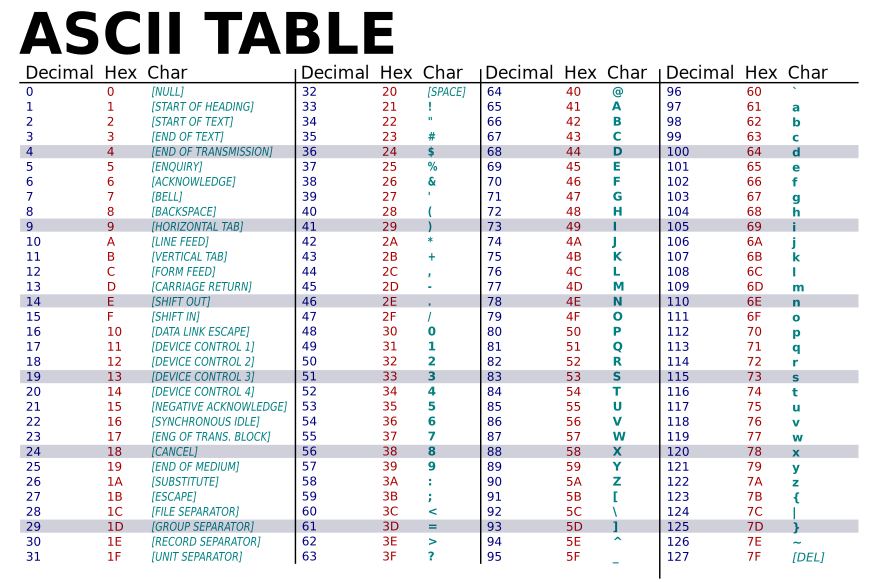

# String Literals

* *"literal"* means "exactly as it's written" 
* a *string literal* is a string whose characters are spelled out explicitly in your code
* JavaScript string literals are surrounded with either single quotes (`'`) or double quotes (`"`)
  * but not both!

```js
"My dog has fleas."
'Vermonters have a hundred words for "snow".'
```

# String Escapes

* some characters can't be typed literally, so you need to use *string escapes*
* backslash (<kbd>\\</kbd>) is the *escape character* in JavaScript strings
* backslash means "the next character means something special"
  * for instance backslash-n (`\n`) means "newline"

```js
console.log("Roses are red,\nViolets are blue;\nCandy is sweet,\nAnd so are you.")
```

# String Messages

A string understands lots of messages. Here are a few:

```js
"drive" + "way"
'Java' + "Script"

"Bert's pal Ernie" + ' sings "Rubber Duckie"'

"titanic".toUpperCase()
"QUIETLY".toLowerCase()

"Java".repeat(10)

"banana".length

"berry".charAt(1)
"berry".charAt(0)
"apple"[3]

"banana".includes("nan")
"banana".endsWith("ana")

"blueberry".replace("blue", "black")
```

Try all of these out in `node` or the browser console!

Check out [MDN String](https://developer.mozilla.org/en-US/docs/Web/JavaScript/Reference/Global_Objects/String) docs for more.

# Slicing and Dicing

Every string is made of lots of other strings.

You can pull out parts of a string with the `slice` message.

```js
// this means "slice from character 0 to character 4"
"blueberry".slice(0, 4) 

// this means "slice from character 4 to the end
"blueberry".slice(4)
```

These start and end numbers are called *indexes* (or *indices* if you're feeling fancy).

[MDN: slice](https://developer.mozilla.org/en-US/docs/Web/JavaScript/Reference/Global_Objects/String/slice)

# String Indexing Explained

Humans like to start counting at 1, but computers like to start counting at 0.

This can be confusing, so here's a visualization to help explain it.

Think of the indexes as pointing at the *spaces between* characters, as in this diagram:

    | B | L | U | E | B | E | R | R | Y |
    0   1   2   3   4   5   6   7   8   9
     
So with this picture in your mind, `slice`...
  
   * includes the character to the *right* of the start index
   * includes the character to the *left* of the end index...
   * ...but *excludes* the character to the *right* of the end index

Try various start and end values in the console and see what happens!

# Characters

Q: A string is "a series of characters"... but what is a character?

A: a character is a *number* (or *character code*) that stands for a *symbol*.

|symbol|code|name|
|---|---|---|
| `A` | 65 | capital A |
| `B` | 66 | capital B |
| `Z` | 90 | capital Z |
| `_` | 95 | underscore |
| `a` | 97 | lowercase A |
| ??? | 10 | newline |

(Some characters stand for *unprintable* symbols like `newline` or `tab` or `bell`.)

# ASCII and ye shall receive-ski

* ASCII: American Standard Code for Information Interchange
* Invented in 1963



<small>(image from [Wikimedia Commons](https://commons.wikimedia.org/wiki/File:ASCII-Table-wide.svg))</small>

# Unicode

* ASCII only goes from 0 to 127
* Unicode is the same as ASCII for values from 0 and 127
    * but Unicode goes a *lot* higher
* Currently more than 130,000 characters, including symbols for
  * 139 modern and historic scripts
  * accents and other diacritics
  * various mathematical ∞, currency £, and cultural ☮ symbols
  * [emoji](https://en.wikipedia.org/wiki/Emoji) 😂
  
# Unicode Strings

JavaScript strings are Unicode

> That means you can use emoji in your JavaScript programs!

Like this:

```js
"😂".repeat(20)
```

 * sadly, this doesn't work in Windows PowerShell
 * more details at our [unicode lesson](/lessons/cs/unicode)

# Comparing Strings

JavaScript strings respond to the `<` and `>` operators.

```js
> "apple" > "cherry"
false
> "banana" < "cherry"
true
```

Strings are compared *one character at a time* using the *Unicode values* of each character.

# Comparing Strings: Example

So if you say `"apple" < "apricot"`...

```js
> "apple".charCodeAt(0)
97
> "apricot".charCodeAt(0)
97

> "apple".charCodeAt(1)
112
> "apricot".charCodeAt(1)
112

> "apple".charCodeAt(2)
112
> "apricot".charCodeAt(2)
114
```

In the above, 112 is less than 114, so the comparison stops there and returns `true`.

# String Comparison Gotcha

In ASCII and Unicode, all the uppercase letters are together (codes 65 to 90), then all lowercase letters (codes 97 to 122).

> That means that **all** uppercase strings are less than **all** lowercase strings.

```js
> "apple" < "banana"
true
> "apple" < "BANANA"
false
```

The standard left-to-right code-to-code comparison algorithm is simplistic but very fast.

It works fine for many applications, but if you're dealing with user input or multiple languages...

# Smart String Comparison

...use [localeCompare](https://developer.mozilla.org/en-US/docs/Web/JavaScript/Reference/Global_Objects/String/localeCompare) instead, which understands case and diacriticals and dialects.

```js
> "banana".localeCompare("CHERRY")
-1
```

Here `-1` means "the left side is less than the right side". Try other comparisons and see what you get!

# LAB: Strings: Exercises

* [FreeCodeCamp](https://learn.freecodecamp.org/javascript-algorithms-and-data-structures)
    - start with the challenge [Declare String Variables](https://learn.freecodecamp.org/javascript-algorithms-and-data-structures/basic-javascript/declare-string-variables)
    - continue through the challenge [Word Blanks](https://learn.freecodecamp.org/javascript-algorithms-and-data-structures/basic-javascript/word-blanks)

* Exercism:
  * Sign up on [exercism.io](http://exercism.io) (using your GitHub id)
  * Join the [JavaScript Track](https://exercism.io/my/tracks/javascript)
  * Follow the "Get started" instructions behind the "Begin walk-through" button on the right-hand side
  * Do the following exercises:
    * [Reverse String](https://exercism.io/my/solutions?exercise_id=reverse-string&track_id=javascript) -- this is possible to do using only [built-in String methods](https://developer.mozilla.org/en-US/docs/Web/JavaScript/Reference/Global_Objects/String#Methods_2) ...but if you can't figure it out, don't worry too much; we'll come back to it when we learn about loops
    
