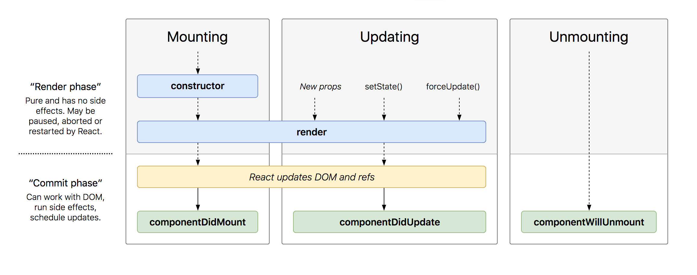

# React Components

* Isolated pieces of a website or app
* Can be rendered manually or programatically
* Dynamic data is passed in via Props
* Generate child compoents with `render()`

```javascript
class Profile extends React.Component {
  userData = () => {
    return data || fetchDataFromDatabase();
  }

  render() {
    <Header>
      <Profile
        name={userData.name}
        interests={userData.interests}
        description={userData.description}
      />
      <Activity />
      <Contact />
    </Header>
  }
}
```

# Using Components

* Typically the `index.js` initiates the components tree from the top level
* Child components are rendered after their parents
* Parents pass Props and State to children

```javascript
<html>
  <body>
    <div id="root"/>
  </body>
  <script>
    ReactDom.render(<Profile />,
      document.getElementById('root')
    )
  </script>
</html>
```

# Using Arrays of Components

* Many components can be rendered at once
* Wrap the components in an array
* React will iterate over and render each

```javascript
class ProfileList extends React.Component {
  render() {
    <Header>
      [
        <Profile userId="One"/>,
        <Profile userId="Two"/>,
        <Profile userId="Three"/>
      ]
    </Header>
  }
}
```

# Building components with Iteration

* Iteration and Loops can be used just like in plain JavaScript
* Many components can be built based on collections of data
* Components can be **conditionally** rendered

```
class Comment extends React.Component {
  render () {
    return (
      <li>
        <p>User: {this.props.user}</p>
        <p>Comment: {this.props.content}</p>
      </li>
    )
  }
}

class CommentList extends React.Component {
  render() {
    const comments = [
      { user: 'Joshua', content: 'Components are my fave!' },
      { user: 'Ada', content: 'Yes they make life easy' },
      { user: 'Alex', content: 'Loved them for years' }
    ];
    const commentComponents = forms.map((comment, index) => {
      return <Comment user={ comment.user } content={ comment.content }/>
    });

    return (
    <div className="comments">
      <h2>Comment List</h2>
      <ul>
      { commentComponents }
      </ul>
    </div>
    )
  }
}
```

# Immutable Components

* Once components are rendered they cannot be updated
* Re-rendering the component is how to update

```html
<html>
  <body>
    <div id="root"/>
  </body>
  <script>
    function tick() {
      const element = (
        <div>
          <h1>Hello, world!</h1>
          <h2>It is {new Date().toLocaleTimeString()}.</h2>
        </div>
      );
      // highlight-next-line
      ReactDOM.render(element, document.getElementById('root'));
    }

    setInterval(tick, 1000);
  </script>
</html>
```


# Ticking Clock Live

<p data-height="265" data-theme-id="light" data-slug-hash="gjdNEB" data-default-tab="js,result" data-user="Dangeranger" data-pen-title="React Clock Example" class="codepen">See the Pen <a href="https://codepen.io/Dangeranger/pen/gjdNEB/">React Clock Example</a> by Joshua Burke (<a href="https://codepen.io/Dangeranger">@Dangeranger</a>) on <a href="https://codepen.io">CodePen</a>.</p>
<script async src="https://static.codepen.io/assets/embed/ei.js"></script>

<https://codepen.io/Dangeranger/pen/gjdNEB>

# Granular Render Updates


# Component Lifecycle

## Mounting

  * constructor()
  * static getDerivedStateFromProps()
  * render()
  * componentDidMount()

## Updating

  * static getDerivedStateFromProps()
  * shouldComponentUpdate()
  * render()
  * getSnapshotBeforeUpdate()
  * componentDidUpdate()

## Unmounting

  * componentWillUnmount()

## Errors

  * componentDidCatch()

# Lifecycle Methods Diagram



<http://projects.wojtekmaj.pl/react-lifecycle-methods-diagram/>
