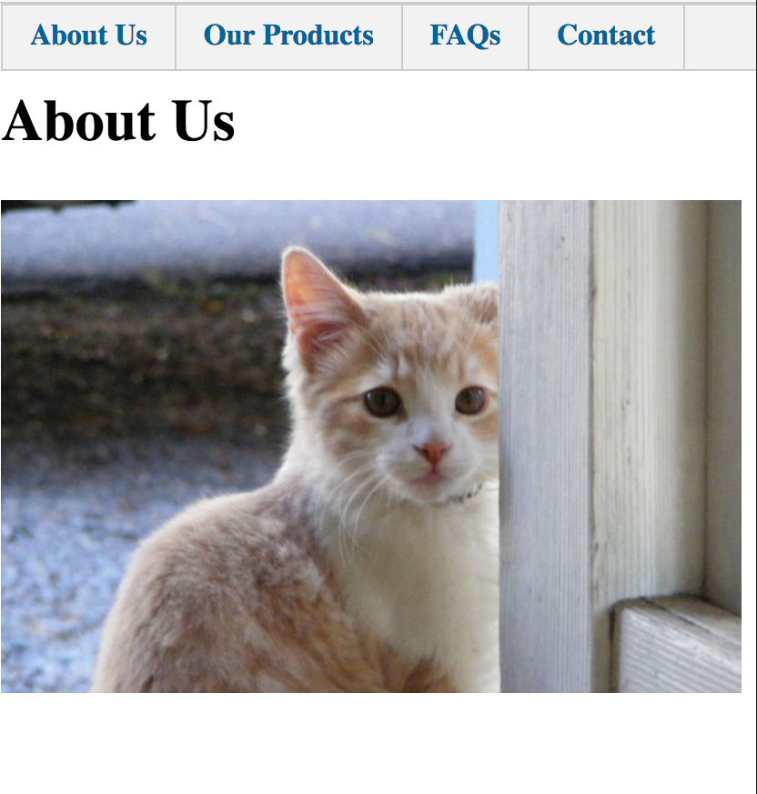

# Page Navigation

  * Finding the way around a site can be challenging without guidance
  * There are tools which can help the end user locate parts of the site

# Anchor Links

* Anchors tags create links to a linkable location
    * Within the same page, using an `#some-id`selector
    * Other page withn the site, using relative `href="/some-page.html"`

```html
@@@html

<a href="#some-place">Link to some-place</a>
```

# Anchor Links (Internal) Example

```html
@@@html
<!DOCTYPE html>
<html>
  <body>
    <nav>
      <ul>
        <li><a href="#internal-link">LINK</a></li>
      </ul>
    </nav>
    <main>
      <div id="internal-link">
        <h1>
          This is an internal link
        </h1>
      </div>
    </main>
  </body>
</html>
```

[Internal Navigation Example](./navigation-anchors-internal.html)

# Anchor Links (External) Example

```html
@@@html
<!DOCTYPE html>
<html>
  <body>
    <nav>
      <ul>
        <li><a href="/some_other_page.html">LINK</a></li>
      </ul>
    </nav>
    <main>
      <div>
        <h1>
          Some content
        </h1>
      </div>
    </main>
  </body>
</html>
```

[External Navigation Example](./navigation-anchors-external-0.html)

# Navigation Bars

* Common component of web pages
* Shape the way users think about the site
* Several ways to build them
* Flexbox makes building these much easier

# Navigation Bars Example 1

```html
@@@html
<!DOCTYPE html>
<html>
<head>
  <style>
    #nav {
        width: 100%;
        float: left;
        margin: 0 0 3em 0;
        padding: 0;
        list-style: none;
    }

    #nav li {
        float: left;
    }
  </style>
</head>
  <body>
    <nav>
      <ul id="nav">
	      <li><a href="#about-us">About Us</a></li>
	      <li><a href="#our-products">Our Products</a></li>
	      <li><a href="#faq">FAQs</a></li>
	      <li><a href="#contact">Contact</a></li>
	      <li><a href="#login">Login</a></li>
      </ul>
    </nav>
  </body>
</html>
```

[Example page](./navigation-bars-example-simple.html)


# Navigation Bars Example 2

```html
@@@html
<!DOCTYPE html>
<html>
<head>
  <style>
    #nav {
      top: 0px;
      float: left;
      margin: 0 0 5em 0;
      padding: 0;
      list-style: none;
      background-color: #f2f2f2;
      border-bottom: 1px solid #ccc;
      border-top: 1px solid #ccc;
    }

    #nav li {
      float: left;
    }

    #nav li a {
      display: block;
      padding: 8px 15px;
      text-decoration: none;
      font-weight: bold;
      color: #069;
      border-right: 1px solid #ccc;
    }
  </style>
</head>
  <body>
    <nav>
      <ul id="nav">
          <li><a href="#about-us">About Us</a></li>
          <li><a href="#our-products">Our Products</a></li>
	      <li><a href="#faq">FAQs</a></li>
	      <li><a href="#contact">Contact</a></li>
	      <li><a href="#login">Login</a></li>
      </ul>
    </nav>
  </body>
</html>
```

[Better Nav Bar Example](./navigation-bars-example-better.html)

# Navigation Bars Example 3

Follow the link to see a fairly complete navigation bar with internally linked content that includes:

  * Full-width nav bar
  * Fixed postion on scroll
  * Hover state style change
  * Borders around all items



[Complete Example HTML](./navigation-bars-example.html)

# Navigation Bars Flexbox

* Flexbox can make laying out a responsive navigation bar much easier

<iframe height="300" width="575" src="./navigation-bars-flexbox.html" marginheight="0" marginwidth="0" scrolling="auto" width="100%" height="100%"></iframe>

[Example Flexbox Navigation](./navigation-bars-flexbox.html)
