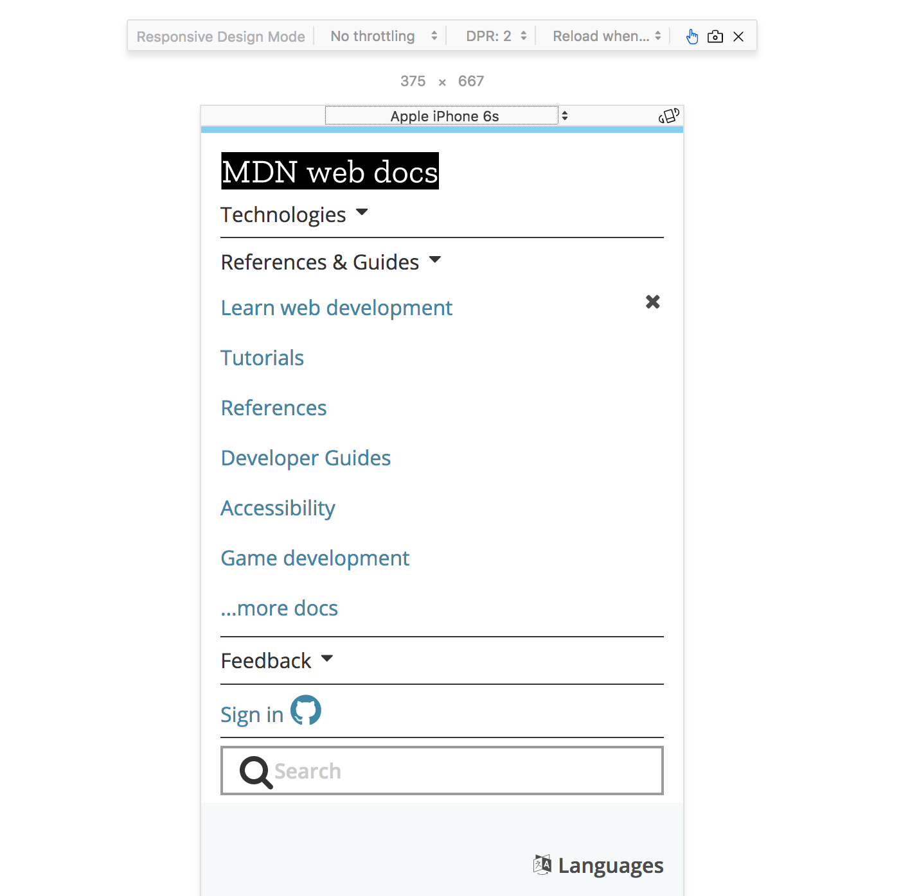

# Responsive Layout

* "Responsive" means that the layout *changes* (responds) based on the width of the screen
* This allows for specific layouts for mobile phones, tablets, screen readers, and more
* Layouts can be redered conditionally based on:
    * Screen size
    * Pixel density
    * Screen orientation
    * Height/Width Ratio i.e. 11:9

*Question: Why might this be important?**


# What is Responsive Development?

* Responsive development is a technique that displays content well regardless of the device it is being viewed on
* This concept is increasingly important, not all users are desktop browsers
* In 2017 and 2018 more than 50% of web traffic was from mobile devices

# Responsive Layout: Media Queries

* CSS3 introduced media queries, which allow developers to apply CSS properties to devices which match rules
* Media queries are the backbone of front-end responsive development with HTML and CSS
* Applying CSS to specific screen widths allows for changing the layout and styles based on the size of a device.
* **Percentage widths** further assist to style your website in a way that scales down based on the screen width.

# Mobile Device Simulator



[Link: Firefox Responsive Design Mode](https://developer.mozilla.org/en-US/docs/Tools/Responsive_Design_Mode "Firefox Responsive Design Mode")

[Link: Chrome Mobile Device Simulator](https://developers.google.com/web/tools/chrome-devtools/device-mode/ "Chrome Mobile Device Simulator")

# Using Media Queries

* Media Queries (`@media`) cause different CSS rules to be applied on different screens


#### Example

This will make our `.nav` element position relative only when the screen size is less than or equal to 768px wide.

```css
@@@css

.nav {
  position: absolute;
}

@media screen and (min-width:768px) {
  .nav {
    position: relative;
  }
}

```

[MDN: Using Media Queries](https://developer.mozilla.org/en-US/docs/Web/CSS/Media_Queries/Using_media_queries "Using_media_queries")


# Mobile-First Development

* Developing mobile first means to start styling out your web page for a mobile device, and then modify the layout for a desktop browser. This helps to reduce load times on mobile devices.
* The result of this is modifying your CSS as screen sizes increase, rather than modifying your CSS as screen sizes decrease.
* In other words, your media queries will be written for minimum widths, not maximum widths.
* Tip: You can also set media queries in-between two screen sizes
