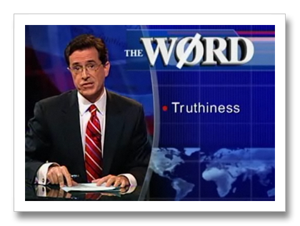

<!SLIDE subsection>
# Conditionals

Ref. WGR Chapter 6, Control-flow techniques

In this section we cover truth, falsiness, and conditions.

# Truthiness and Falsiness



(*not* in the Steven Colbert sense)

* Truthy things make "if" succeed
* Falsey things make "if" fail

!SLIDE
## Falsey Things
* `nil`
* `false`
* that's it!

## Truthy Things
* `true`
* `0`
* `""`
* `"false"`
* pretty much anything else


# `if`

    if condition then
      statement
    end

* if `condition` is *truthy* then execute `statement`

* `then` is optional, so you normally use

        if condition
          statement
        end


# one-line `if`
    
    if condition then statement end

    if condition; statement; end

    statement if condition

# `else`

    if condition
      statement1
    else
      statement2
    end

* if `condition` is *truthy* then execute `statement1`
* if `condition` is *falsy* then execute `statement2`

# `elsif`

    if condition1
      statement1
    elsif condition2
      statement2
    else
      statement3
    end
    
it's spelled `elsif` **not** `elseif` or `else if`

# `not`

    if x == 2
      puts "two"
    end

    if not x == 2
      puts "not two"
    end

# `not` vs. `!`

    if x == 2
      puts "two"
    end

    if not x == 2
      puts "not two"
    end

    if !x == 2
      puts "not what you think!"
    end

# `!` is clingy

The bang operator binds very tightly

```ruby
not x == 2  #=> not (x == 2)
!x == 2     #=> (!x) == 2
```

so that actually means
```ruby
if (!x) == 2
```

and assuming `x` is a number, `!x` will always be `false`

# `!` gotcha solved

```ruby
    if !(x == 2)
      puts "not two"
    end
```

* Moral: use `not` in conditions
  * or use `unless` 
  * or use `!=`
  * or use a lot of parentheses
    * they're free!

# `!=`

* "bang equal" means "not equal"
* `x != 2` is equivalent to `!(x == 2)`

# unless

* `unless` means "if not"

        puts "night" unless day

* it can make your code read better

        wear_sweater unless summer? or wearing_sweater?

* it can also make your code read worse

        button.hide unless not button.disabled?
        
* never use `unless` with `not` or `else`
  * unless you really know what you're doing `:-)`
  * **double negatives are not unconfusing**

# Logic is hard

|Statement|Value|
|---|---|
|  not nil | true |
|  not 0   | false |
|  !0 | false |
|  0 == false | false |
|  nil == false | false |
|  y = false | false |
|  y == false | true |
|  x = 0 |0 |
| "foo" if (x = 0) | "foo" |
|  x == y | false |
|  x != y | true |
|  !x==y | true |
|  not x==y | true |
    
## (...let's go shopping)

# Comparison or Assignment?

|Language | Statement | Purpose |
|---|---|---|
| mathematics | X = 2  | comparison |
| Basic       | LET X = 2 | assignment |
| | | |
| Fortran     | X = 2  | assignment :-( |
|             | X == 2 | comparison |
| | | |
| Algol, Pascal | X := 2 | assignment :-) |
|             | X = 2  | comparison :-) |

<i>
  "A **notorious example for a bad idea** was the choice of the equal sign to denote assignment. It goes back to Fortran in 1957 and **has blindly been copied by armies of language designers**. Why is it a bad idea? Because it overthrows a century old tradition to let "=" denote a comparison for equality, a predicate which is either true or false. But Fortran made it to mean assignment, the enforcing of equality. In this case, the operands are on unequal footing: The left operand (a variable) is to be made equal to the right operand (an expression). x = y does not mean the same thing as y = x."

— [Niklaus Wirth](http://en.wikipedia.org/wiki/Assignment_%28computer_science%29#Assignment_versus_equality), Good Ideas, Through the Looking Glass (2005)
</i>

# assignment in conditionals

* `if x = 1` gives a warning, since it will always be true
* `if x = y` gives no warning, since you might mean it
  * it still looks funny
  * it can be useful, e.g.

            if (last_name = person.family_name)
              # person.family_name is not nil, so...
              puts last_name
            end

# `case`

```ruby
case var
when value1
  puts "var is sorta value1"
when value2, value3
  puts "var is sorta value2 or maybe value3"
else
  puts "var is weird"
end
```

# threequal

* case comparison uses the `===` operator
  * aka "threequal"
* it's normally the same as `==` but can be overridden
  * e.g. for Class, `===` also means `is_a?`, so you can do this:

```ruby
case input
when Fixnum
  input
when String
  input.to_i
when Array
  input.first.to_i
end
```

# threequal transitivity gotcha

    >> Fixnum === 1
    => true
    >> 1 === Fixnum
    => false

### Solution: use `is_a?` instead:

    >> 1.is_a? Fixnum
    => true

# a note on Boolean

There is no Boolean class in Ruby

Only `TrueClass` and `FalseClass`

(Why? [This guy knows the answer.](http://stackoverflow.com/a/3194797/190135))

# `!!`

* `!!` converts anything into either true (if it's truthy) or false (if it's falsey)
* but cool Rubyists never use `!!` 
  * they're down with truthiness

# or-equals

    def name
      @name ||= "Anonymous"
    end
    
* Means "if `@name` has a value, cool, but otherwise make it `'Anonymous'`"
* Relies on "logical or" and "nil is falsey" semantics
* There's also "plus-equals" (`+=`) and so forth

# or-equals expanded

These are equivalent:

```ruby
# with or-equals
@name ||= "Alex"

# as a boolean expression
@name || (@name = "Alex")

# with an if statement
if (@name != nil)
  @name
else
  @name = "Alex"
end
  
```
