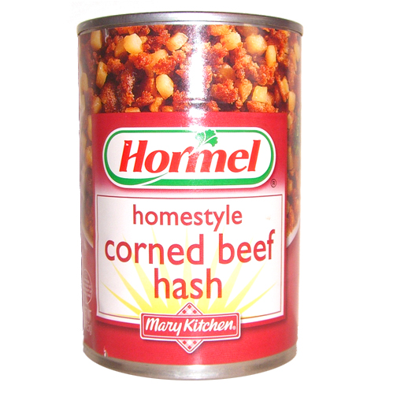

!SLIDE subsection
# Hashes

Ref. WGR Chapter 9, Section 9.3, Hashes

# Hash



* unordered collection of key/value pairs
* keys must be unique
* values can be anything

# Hash is also known as...

  * Map
  * Associative Array
  * Dictionary
  * Name/Value Pair Store
  * Key/Value Pair Store

# Setting and Getting Hash Values

```ruby
states = Hash.new

states["CA"] = "California"
states["MA"] = "Massachusetts"
states["NY"] = "New York"

states["MA"].reverse #=> "sttesuhcassaM"
```

# Hash literals

a Hash can be defined *literally* (inline) with braces e.g.

```ruby
states = {
           "CA" => "California",
           "MA" => "Massachusetts",
           "NY" => "New York"
         }

states["MA"] #=> "Massachusetts"
```

The little `=>` arrow is called a **hash rocket**.

# Remember, strings are not symbols!

```ruby
states = {:MA => "Massachusets"}
states["MA"] #=> nil
states[:MA]  #=> "Massachusets"
```

This is such an annoying problem that Rails invented a new version of Hash named `HashWithIndifferentAccess`
that converts string keys into symbol keys.

(`HashWithIndifferentAccess` is such an annoying name that many people call it `Mash` instead.)

# Hash Literals with Symbol Keys

Ruby 1.8 or 1.9:

    {:foo => "bar", :baz => "baf"}

Ruby 1.9 only:

    {foo: "bar", baz: "baf"}

# Hash arguments

When passing a hash to a method,

*the braces are optional*...

...**if** you're calling a method

...**and** the hash is the final argument

```ruby
invite({:name => "Alice", :age => 18})

invite :name => "Alice", :age => 18
```

This is called "the default hash" (which is a silly name for it).

# hash parameters plus hash literals => named parameters

These are all equivalent:

```ruby
User.new({:name => "Alex", :email => "alex@stinky.com"})

User.new(:name => "Alex", :email => "alex@stinky.com")

User.new :name => "Alex", :email => "alex@stinky.com"

User.new name: "Alex", email: "alex@stinky.com"

User.new email:"alex@stinky.com", name:"Alex"
```

...so passing a hash literal *kinda sorta almost* looks like named parameters.

(Ruby 2.0 will support proper named parameters, using the same calling syntax.)

# Hash methods

* each, each_pair
* keys, values
* has_key?, has_value?
* merge, merge!
* delete, delete_if

# `merge` to combine two hashes

Here's a handy trick:

```ruby 
class Hash
  alias_method :<<, :merge!
  alias_method :+, :merge
end

{foo: 1} << {bar: 2}
  => {:foo=>1, :bar=>2}   # destructive

{foo: 1} + {bar: 2}
  => {:foo=>1, :bar=>2}   # constructive
```


