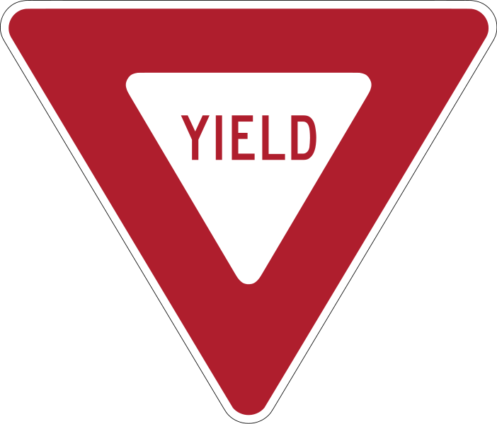

# Code Blocks

Ref. WGR Section 6.3, "Iterators and code blocks"

# What is a block?

> a block is a chunk of code

the term "block" overlaps with the terms...

> closure, proc, lambda, function, function pointer, anonymous function,
> callback, runnable, functor, delegate

# method vs. block vs. proc

* a **method** is a chunk of code starting with `def`
* a **block** is a chunk of code starting with `do`
* a **proc** is an *object* that points to a *block*

(Of these three, only a *proc* can be stored in a variable or named parameter.)

# How do you declare a block?

* Anywhere you see "do" in Ruby, it's the start of a *block*

```ruby
3.times do
  puts "Hip! Hip! Hooray!"
end
```

* Blocks can also be wrapped in curly braces

```ruby
3.times { puts "Hip! Hip! Hooray!" }
```

* braces are for a single line, `do...end` for multiple lines

# What are blocks for?

A block is a piece of code that is declared but not run in the place it's written. The idea is to leave it up to the receiver of the block to decide when to call it. -- Wolfram Arnold

So you use blocks for...

* stashing away some code to be run later
  * callbacks
  * initializers
  * asynchronous IO
* separating the body of a loop from the loop itself
  * iterators
* running some extra code before and/or after
* making your code look cool

# The "Hole In The Middle" Pattern

* Imagine two very similar algorithms
  * capitalize each string in an array
  * reverse each string in an array
* Now imagine extracting the common parts into a single function...
  * ...with a hole in the middle
* The block you write fills that hole

<http://blog.enfranchisedmind.com/posts/the-hole-in-the-middle-pattern/>

# `proc`

* The `proc` keyword defines a block
* You can store that block into a variable
* You can call that block with the `call` method

```ruby
say_hi = proc { puts "hi" }
say_hi.call  # prints "hi\n"
```

## procs can take parameters too

```ruby
capitalize_it = proc { |word| word.capitalize }
capitalize_it.call("banana")   #=> "Banana"
capitalize_it.call("cherry")   #=> "Cherry"
```

# Passing Blocks to Methods Explicitly with Procs

`twice` is a less cool version of `times` that takes a proc parameter

```ruby
def twice(action)
  action.call
  action.call
end
```

You can assign a proc to a variable and pass it as a parameter

```ruby
say_hi = proc do
  puts "hi!"
end
twice(say_hi)  # prints "hi!\n" twice
```

You can also define proc *inline* rather than assigning it to a variable

```ruby
twice(proc do
  puts "hi!"
end)  # prints "hi!\n" twice
```

# The Default Block

* Every method, no matter what its parameter list, might get an optional magic invisible block parameter
* This is called "the default block" and the method can call it using `yield`



# Passing Blocks to Methods Implicitly with the Default Block

`twice` is a less cool version of `times` that takes a default block (invisible parameter)

```ruby
def twice
   yield
   yield
end

twice do
  puts "hi!"
end
```

"twice do" kind of almost resembles English a little, right?

# `yield` turns prose into poetry

Which is more beautiful?

Using procs:

```ruby
def twice block
  block.call
  block.call
end

twice(proc { puts "hi" })
```

Using the default block:

```ruby
def twice
  yield
  yield
end

twice { puts "hi" }
```


# The default block can accept parameters

```ruby
def twice
  yield 0
  yield 1
end

twice do |i|
  puts "#{i+1} Mississippi"
end
```

prints

    1 Mississippi
    2 Mississippi

# Passing Blocks Implicitly

`for_each` is a less cool version of `Array.each`

```ruby
def for_each(array)
  i = 0
  while i < array.size
    yield array[i]
    i += 1
  end
  array
end

names = ["alice", "bob", "charlie"]
for_each(names) do |item|
  puts "hi, #{item}"
end
```

* `array` is a parameter to the `for_each` function
* `item` is a parameter to the block

# Blocks can also return values

`map_it` is a less cool version of `Array.map`

```ruby
def map_it(array)
  i = 0
  out = []
  while i < array.size
    out << yield(array[i])
    i += 1
  end
  out
end

names = ["alice", "bob", "charlie"]
map_it(names) do |item|
  item.reverse
end
#=> ["ecila", "bob", "eilrahc"]
```

# block_given?
* `block_given?` is true if a block was passed
* common use:

        yield if block_given?

# Making the default block visible

`&` turns the default block into a proc

```ruby
def for_each(array, &p)
  i = 0
  while i < array.size
    p.call(array[i])
    i += 1
  end
  array
end

a = ["alice", "bob", "charlie"]
for_each(a) do |item|
  puts "hi, #{item}"
end
```

# You can also use & in the caller

turns a proc into a default block

    capitalize_word = proc {|w|w.capitalize}
    s.split.map(&capitalize_word).join

# lambdas

Ruby also has a keyword `lambda` that works just like `proc`, except for a few technical details.

* a lambda *enforces arity* (the number of parameters)
* in a lambda, `return` exits the *block*, not the *enclosing method*

`proc` is easier to use but `lambda` is more nerdy

