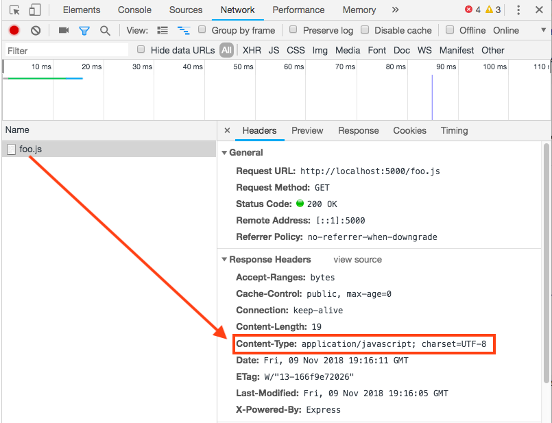

# Serving Files

At its core, HTTP is a *file transfer protocol*.

* the *path* element of a URL is based on a Unix file path
* most web servers directly map incoming URL paths to filesystem paths
* because these files are stored on disk on the server, they are called *static files*
  * to distinguish from *dynamic pages* (aka *routes*) which the server will create on the fly for every request 

# node-static

In earlier lessons, you may have used the `node-static` package to serve your HTML, JS, CSS, images, etc...

*node-static* is a standalone static file server built in NodeJS

It's useful for local development but not great for production deployments

Usage:

```
$ npm install node-static
$ npx node-static
npx: installed 6 in 1.359s
serving "." at http://127.0.0.1:8080
```

# static file server in Express

* Express comes with its own static file server
* Using it is a one-liner: 

        app.use(express.static('.'))

# LAB: static file server

* create a new Express project dir called `static-server`:

        cd ~/code
        mkdir static-server
        npm init -y
        npm install express
        code .
    
* create a file called `app.js` containing the following code:

        const express = require('express')
        const app = express()
        const port = process.env.PORT || 5000
        
        app.use(express.static('.'))
        
        app.listen(port, () => console.log(`Example app listening on port ${port}!`))

* create a file called `index.html` containing

        <h1>Hello in HTML</h1>

* in `package.json`, add

        {
          "scripts": {
            "start": "node app.js"
          }
        }

* launch the web server using `npm start`

* Now open a web browser and visit <http://localhost:5000/index.html>


# oops

The good news: your web server can now serve static files to its clients!

The bad news: your web clients can now see *any files they like* in your project

(including your server source code and configuration files, which may include secrets like passwords)

## LAB: Hack Your Own Server

open a web browser and visit <http://localhost:5000/package.json>

`package.json` should probably be more secret than that `:-)`

# Solution: public directory

To keep server-side code and configuration files secret, most web apps have a *public* directory containing static files

This is one major difference between *static sites* and *web apps* -- since some of your code runs on your server, and some runs on your client's browser, your project directory structure needs to segregate *client-side files* from *server-side files*

* in your top-level project dir, type `mkdir public`
* in your `app.js`, change the `app.use` line to

        app.use(express.static('public'))

Now you can put HTML, CSS, PNG, and `.js` files inside `/public` where your clients can fetch them as needed

* *move* index.html` from your top-level project dir (`static-server`) to your `public` dir
    * either use VS Code's GUI
    * or run `mv index.html public` from the terminal 

* restart your server
    
* Now open a web browser and visit <http://localhost:5000/index.html>

> Note that the URL path `/index.html` maps directly to the filesystem path `static-server/public/index.html`

# index.html

A little historical note...

* in the early WWW, visiting a directory always showed a list of all the files in that directory
* this list was called an *index* since it was in alphabetical order and just showed names and other information about files, but not their contents
* some web servers would look for a special file named `index.html` and if it was present, would serve that file instead of the index
* these days, most web servers don't show any indexes at all, ever...
* ...but the default page for a directory is still named **index**.html
* This is *why* index.html is named *index* -- it is a *replacement* for the automatic default *index* page.

Now open a web browser and visit <http://localhost:5000/> and you will see the contents of `index.html` ("Hello in HTML") even though your request did not contain the words "index" or "html", just the path `/`

# Content-Type

* files on disk usually have *extensions* that tell you what file type they are
    * `.html` or `.htm` means HTML
    * `.js` means JavaScript
    * `.css` means CSS Stylesheet
    * etc.

* but URLs often *do not* have extensions
    * `https://developer.mozilla.org/en-US/docs/Web/JavaScript` is an HTML page but *does not* end in `.html`

* so web servers must read the file type extension and then use the `Content-Type` HTTP header to tell the client what format the file is in
    * `text/html` means HTML
    * `application/javascript` means JavaScript
    * `text/css` means CSS Stylesheet
    * ...these are called *MIME Types* (after the Multipurpose Internet Mail Extensions specification)

# Viewing Headers

**TIP:** open the browser DevTools and click on the Headers sub-tab to see Content-Type and other headers:



# 404 Not Found and other status codes

open a web browser and visit <http://localhost:5000/oops.html>

if there is an error loading the file (in this case, there is simply no file by that name),
 
the server must send the correct *[status code](https://en.wikipedia.org/wiki/List_of_HTTP_status_codes)*

  * (404 means "not found")
  
Note: even though there is an error, the server *still returns a body and content-type* for display to the user.

In this case, we just see Express' boring default error page, but it's possible to get [very creative](https://www.canva.com/learn/404-page-design/) with web site error pages.
